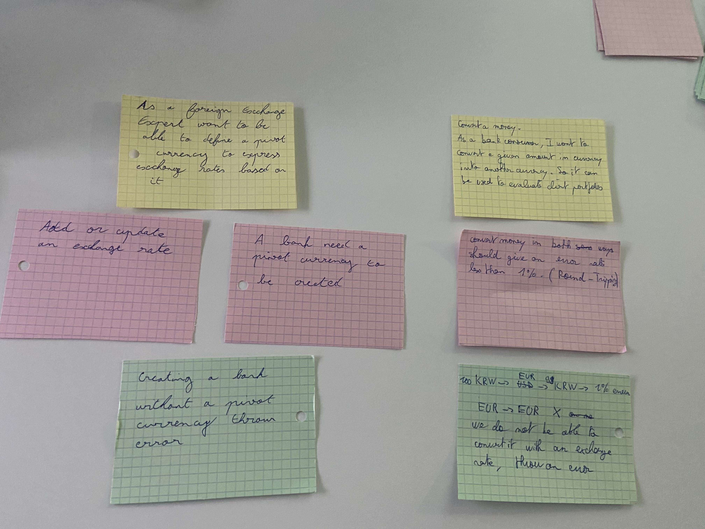

# Example Mapping

## Format de restitution
*(rappel, pour chaque US)*

```markdown
## Titre de l'US (post-it jaunes)

> Question (post-it rouge)

### Règle Métier (post-it bleu)

Exemple: (post-it vert)

- [ ] 5 USD + 10 EUR = 17 USD
```

Vous pouvez également joindre une photo du résultat obtenu en utilisant les post-its.

## Restitution

## Story 1: Define Pivot Currency

```gherkin
As a Foreign Exchange Expert
I want to be able to define a Pivot Currency
So that I can express exchange rates based on it
```

## Story 2: Add an exchange rate
```gherkin
As a Foreign Exchange Expert
I want to add/update exchange rates by specifying: a multiplier rate and a currency
So they can be used to evaluate client portfolios
```

## Story 3: Convert a Money

```gherkin
As a Bank Consumer
I want to convert a given amount in currency into another currency
So it can be used to evaluate client portfolios
```


#### Rules
  - add or update an exchange rate
  - a bank need a pivot currency to be created
  - convert money in both ways should give an error rates lesss then 1% ( Round - Tripping)

#### Exemples
  - Creating a bank without  a pivot currency throw error
  - 100 KRW -> EUR -> 99 KRW -> 1% error
  EUR -> EUR X
  We do not be able to convert if with an exchange rate, throw an error.


#### Mapping


